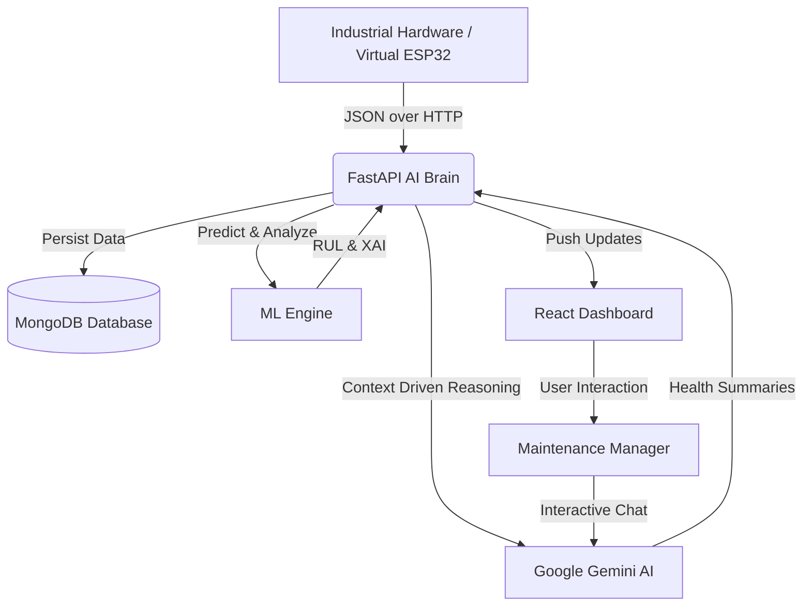

# Vital Sense AI - Intelligent Machine Health & Predictive Maintenance Platform

**Developed by: MMN (Mithun)**

Vital Sense AI is a cutting-edge, self-learning platform designed for the next generation of industrial maintenance. By combining real-time IoT sensor data, advanced Machine Learning algorithms, and Generative AI reasoning, Vital Sense transforms raw telemetry into actionable, natural-language health insights.

---

## 🛠️ System Architecture & Workflow

The platform follows a modular distributed architecture, ensuring real-time performance and high scalability.



---

## 🌟 Key Features

### 1. Advanced Machine Intelligence
- **Remaining Useful Life (RUL)**: Using linear regression on historical health trends, the system predicts exactly how many hours of operation remain before a potential failure.
- **Explainable AI (XAI)**: Don't just get a status; understand *why*. The dashboard highlights the specific sensor (T, V, or C) that is driving the health degradation.
- **Self-Learning Pipeline**: The system continuously updates its health benchmarks based on the latest 100 sensor readings.

### 2. Generative AI Maintenance Assistant
- **Automated Summaries**: Integrated with **Google Gemini AI** to translate complex vibrates and temperatures into a "human-readable" health report.
- **Interactive Chat**: A built-in "Maintenance Assistant" allows users to ask questions like *"Is M-101 safe to run for another 10 hours?"*

### 3. Multi-Machine Scalability
- **Sidebar Navigation**: Switch between different machine IDs (M-101, M-102, etc.) with a single click.
- **Concurrent Simulation**: The system can handle dozens of machines sending high-frequency data simultaneously.

---

## 🚀 One-Click Quick Start (New PC)

We have automated the entire environment setup to ensure zero-configuration deployment.

### **Step 1: The First-Time Setup**
Double-click **`setup_project.bat`**. This will:
- Initialize the Python virtual environment.
- Install all backend dependencies (pip).
- Install all frontend components (npm).
- Install the Wokwi CLI for hardware simulation.

### **Step 2: Start the System**
Double-click **`run_start.bat`**. This will automatically:
- Launch the **FastAPI AI Brain** on `localhost:8000`.
- Launch the **React Dashboard** on `localhost:5173`.
- Launch **Data Simulators** for multiple machines.
- Launch the **Virtual ESP32 Terminal**.
- **Auto-Open** your default browser to launch the dashboard.

---

## 🔧 Component Breakdown

### **Backend (FastAPI)**
The "Brain" of the project. It handles data ingestion, executes the ML models, manages the MongoDB persistence layer, and interfaces with the Google Generative AI API.
- **File**: `backend/main.py`
- **Port**: 8000

### **Frontend (React + Vite)**
A high-performance, glassmorphic UI designed for industrial monitoring. Features real-time charting (Recharts) and dynamic animations (Framer Motion).
- **File**: `frontend/src/App.jsx`
- **Port**: 5173

### **Simulation Engine**
Includes both a high-speed Python sensor simulator and a visual Wokwi hardware interface.
- **Python Sim**: `simulation/simulate_sensors.py`
- **Virtual ESP32**: `simulation/virtual_esp32.py`
- **Wokwi**: `simulation/wokwi/`

---

## 🔐 Security & Local Configuration

### **Environment Variables**
Create a `.env` file in the `backend/` directory with the following keys:
```env
MONGODB_URL=mongodb://localhost:27017
GEMINI_API_KEY=YOUR_GEMINI_KEY_HERE
```

### **GitHub Best Practices**
The project includes a root `.gitignore` that automatically excludes:
- Sensitive `.env` files.
- Large `node_modules` folders.
- Documentation templates (`Masterprompt.txt`).
- Platform-specific build binaries.

---

## 🧑‍💻 Developed By
**MMN (Mithun)**
*Passionate about combining IoT and AI to solve real-world industrial challenges.*

---

## 📜 License
This project is for educational and industrial research purposes. All AI features are powered by free-tier models (where applicable) and custom-built ML logic.

---

### **Happy Monitoring! 🏁🏁**
